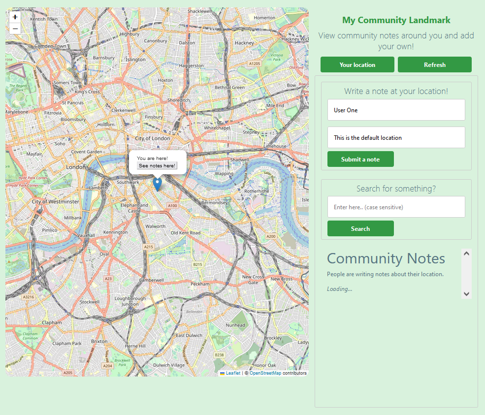

# My Community Landmark
[View](https://my-community-landmark.azurewebsites.net/)
adapted from [My Community Directory](https://www.mycommunitydirectory.com.au/) and [My Community Diary](https://www.mycommunitydiary.com.au/)

### Overview

#### This project is for training and educational purposes only!

This is a Single Page Web App utilising modern and popular/up-to-date technologies.
As part of my application to My Community Directory
- _**Responsive**_, mobile-friendly
- Consuming Microsoft's Azure for Web App Hosting
- ASP.NET Core 6.0 (C#) as the Backend framework & REST API
- Frontend using ReactJS & libraries
- Styling with CSS/SASS
- Leaflet as a Javascript Library for the interactive map

### Setup

`npm i`
`npm start`
 
#### See its [Backend](https://github.com/noedigsti/My-Community-Landmark-BE)
